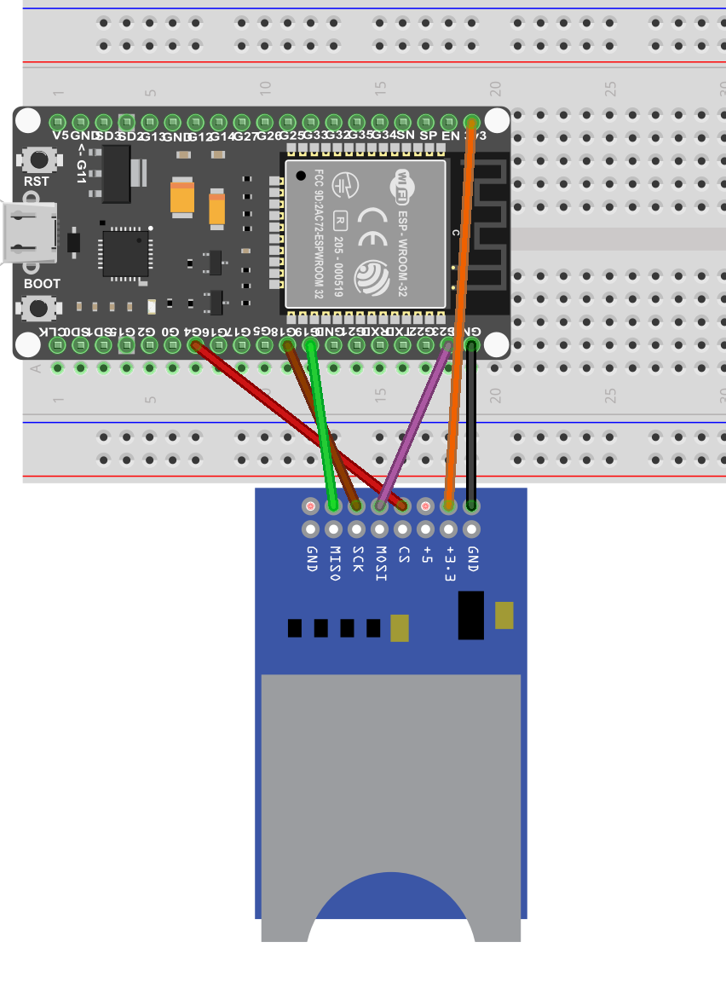
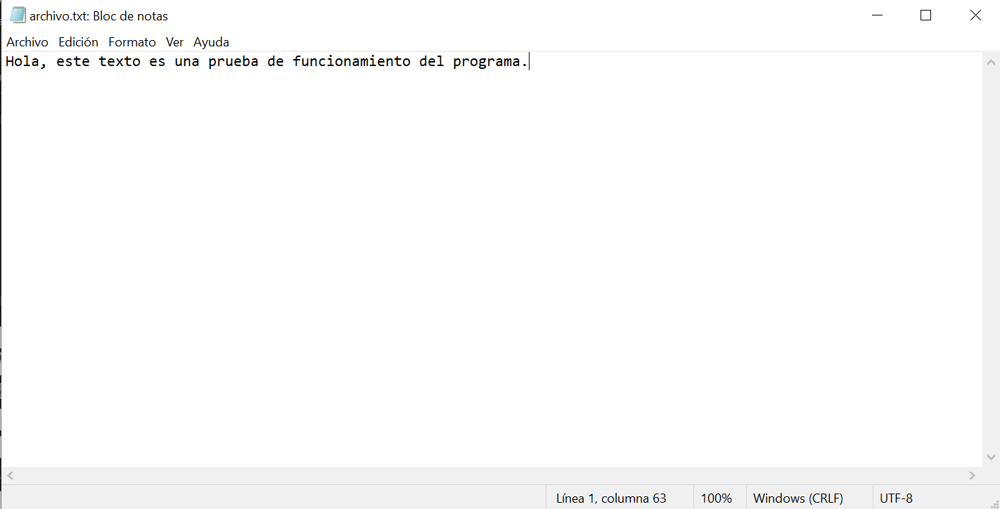
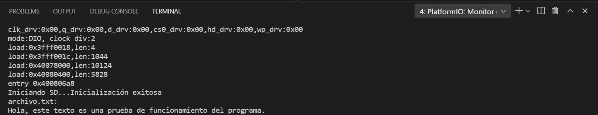

# Práctica 6.1 Buses de comunicación II (SPI)
###### Andrea Muñiz
<p></p>

## Programa + explicación

> Declaramos las librerias necesarias

```
#include <Arduino.h>
#include <SPI.h>
#include <SD.h>
```

> Declaramos una variable tipo File

Esta variable la utilizaremos para poder trabajar con el archivo.

```
File myFile;
```

> Función setup()

En esta función inicializamos el serial a una velocidad de 115200 e informamos por el monitor que se está iniciando la SD.
Con un bucle _if_ conseguimos que en caso de que no se inicie la SD informe del error escribiendo por el monitor _No se pudo inicializar_. En el caso de que no suceda esto y se pueda inicializar la SD, podremos leer por el monitor _Inicialización exitosa_. 
A continuación si encuentra el archivo de texto con el nombre _archivo.txt_, lo abre, escribe por el monitor el contenido y lo vuelve a cerrar. En caso de no poder abrirse el documento, informará del error escribiendo por el monitor _Error al abrir el archivo_.

```
void setup(){
  Serial.begin(115200);
  Serial.print("Iniciando SD...");
  if(!SD.begin(4)){
    Serial.println("No se pudo inicializar.");
    return;
  }
  Serial.println("Inicialización exitosa");
  myFile = SD.open("/archivo.txt");
  if(myFile){
    Serial.println("archivo.txt: ");
    while(myFile.available()){
      Serial.write(myFile.read());
    }
    myFile.close();
  }
  else {
    Serial.println("Error al abrir el archivo");
  }
}
```

> Función bucle

Para este ejercicio no es necesario un bucle así que lo dejamos vacío.

```
void loop(){
  
}
```

***

## Montaje



***

## Salida de la impresión serie

A continuación se adjuntan dos imagenes, una es una captura del documento _archivo.txt_, la otra es la salida de la impresión serie.


