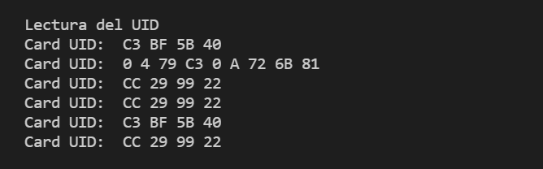

# Práctica 6.2 Buses de comunicación II (SPI)
###### Andrea Muñiz
<p></p>

## Programa + explicación

> Declaramos las librerias necesarias

```
#include <Arduino.h>
#include <SPI.h>
#include <MFRC522.h>
```

> Definimos los pines de reset y ss

```
#define RST_PIN 9
#define SS_PIN 10
```

> Creamos la constante para el lector

```
MFRC522 mfrc522(SS_PIN, RST_PIN);
```

> Función setup()

En esta función inicializamos el serial a una velocidad de 115200. A continuación inicializamos el bus SPI y el lector rfid. Por último, informamos por el monitor escribiendo "Lectura del UID".

```
void setup(){
    Serial.begin(115200);
    SPI.begin();
    mfrc522.PCD_Init();
    Serial.println("Lectura del UID");
}
```

>Función bucle

Primero creamos un _if_ el cual si detecta una nueva tarjeta continua al siguiente _if_ el cual lee la tarjeta y escribe por el monitor "Card UID" y se genera un bucle _for_ cuya función es escribir el ID de la tarjeta leída. Para terminar la función _loop_ se utiliza la función _PICC.HaltA()_ para finalizar la lectura de la tarjeta.

```
void loop(){
    if(mfrc522.PICC_IsNewCardPresent()){
        if(mfrc522.PICC_ReadCardSerial()){
            Serial.print("Card UID: ");
            for(byte i = 0; i < mfrc522.uid.size; i++){
                Serial.print(mfrc522.uid.uidByte[i] < 0x10 ? " 0 " : " ");
                Serial.print (mfrc522.uid.uidByte[i], HEX);
            }
            Serial.println();
            mfrc522.PICC_HaltA();
        }
    }
}
```

***

## Salida de la impresión serie

Para probar la función del lector se han utilizado distintas tarjetas, por ello salen diferentes ID.
